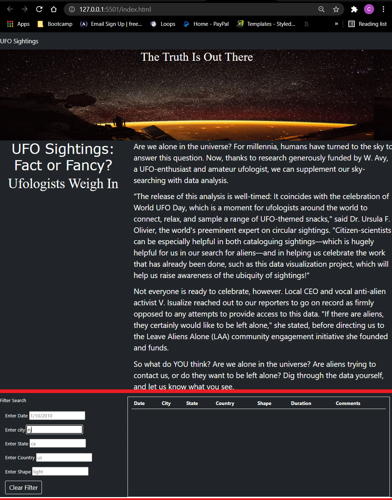

# UFO-s

## Overview of the analysis
The purpose  of this analysis is to update Dana's webpage to provide a more in-depth analysis of UFO sightings 
by allowing users to filter for multiple criteria at the same time. In addition to filtering by date, users
can now filter by city, state, county and shape

## Results
- Please refer below on how to navigate thorugh the site.
	* As soon as the html page is loaded the user with be able to scroll through the table of all UFO reports.
		- The page has been updated so that the table will update on the keydown stroke
			* so as soon as the user finishes typing the search the table will auto populate.
			* 
		- If the filter word or date does not exist or is incorrectthe table will not populate.
			* 
		- The user can also do multiple filters for example filtering by "state,shape,date"
			* 
			* if one of the filters does not exist the table will end up blank
		- Finally there are two ways to reuturn to the unfiltered list. 
			* By clicking the " UFO Sightings" heading on the top left corner of the page
			* By clicking on the "Clear Filter" button to the left of the table. 
			* 
		
	
## Summary

This webpage has been updated to improve the users interactions, but there are still has some improvements to be made.
Although the list currently updates from key strokes if the user was to backspace on all filters the table will end up blank
instead of return to the unfiltered table. Therefor the suer will have to return to the index which is why i chose to add the
"Clear Filter" button since some user wont remember to click on the "ufo sightings" heading the button. Another future request
would be to use a live api or database so that the user can have a larger range of data to search from. This webpage is still 
at a great standing point for the current data set Dana has. 

	
		
